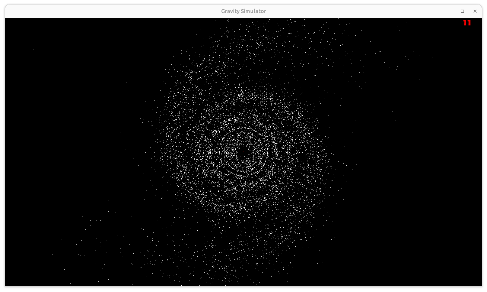

# Gravity_simulator (LINUX ONLY)
This program is a simulator for small galaxies made with clusters of planets orbiting a Black Hole or a Sun. The simulator use SFML 3 for the graphic rendering on screen while the physics of the galaxy is computed with custum C++ scripts (As it is a simulator made for real time computation, the physics are not necessarily 100% accurate but tries to emulate realistic behaveours with some approximations). READ THE WARNINGS BEFORE RUNNING THE PROGRAM. 



## INSTALL
To run the program, first download the repository in your prefered folder, you can use this command from terminal :
```bash
 git clone https://github.com/tharu62/Gravity_simulation.git
```
Then you will need to build the program using CMake. 
<!-- On Windows 11 you will need to install the necessary MingW compiler comatible with SFML Ver.3.0.0p
You can find all necessary information in their website. 

To compile on Windows 11, from the Gravity_Simulation directory use this commands from terminal :
```bash
 mkdir build
 cd build
 cmake ..
 cmake --build build 
```-->
To compile on Linux. from the Gravity_Simulation directory use this commands form terminal :
```bash
 cmake -B build
 cmake --build build
```

## RUN

To run the program you can go to "build/bin/main" and type as argument the number of planets to compute in the simulation.
By default the simulation is set on Black Hole at the center and rendering with points and not circles.
You can try some combination of rendering shapes and Celestial bodies by uncommenting and commenting some line of code in the Application.hpp and SetUp.hpp files, then recompile using the command :
```bash 
 cmake --build build
```

# WARNINGS

A number of planets too high could break the simulator as some variables could go into overflow or the fps will drop significally. 

The Newton:: compute_forces(...) method has a time complexity of O(n^2) which means is very slow (but also very precise).

Some functions are working in progress : Merge(...) , Runge_Kutta::update_position(...) and Euler::update_position_solar_system().

```bash 
  _   _                        __ ___                     _      
 | | | |                      / /|__ \                   | |     
 | |_| |__   __ _ _ __ _   _ / /_   ) |      ___ ___   __| | ___ 
 | __| '_ \ / _` | '__| | | | '_ \ / /      / __/ _ \ / _` |/ _ \
 | |_| | | | (_| | |  | |_| | (_) / /_     | (_| (_) | (_| |  __/
  \__|_| |_|\__,_|_|   \__,_|\___/____|     \___\___/ \__,_|\___|
```                                                               
                                                                 
